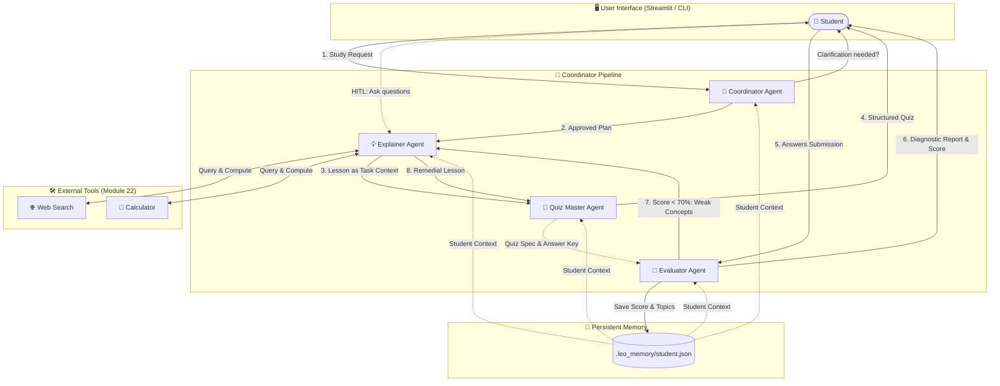

# 🎓 Leo: Multi-Agent AI Tutor

> 🎥 **Demo Video:** [Watch the Walkthrough on Google Drive](https://drive.google.com/file/d/1wlI009nKAwRElRV_LWQKP3LKoUv1Yymm/view?usp=sharing)

Leo is an intelligent, multi-agent educational assistant engineered with **CrewAI** and the **Google Gemini API**. Instead of acting as a single monolithic chatbot, Leo decomposes the pedagogical process across four specialized AI agents that collaborate, execute real context handoffs, remember student mastery, use external tools, and trigger automated remedial feedback loops.

---

## 🌟 Key Highlights

- **4 Specialized Agent Roles:** Distinct roles, system prompts, goals, and behavior patterns.
- **Real Agent Handoffs:** Structured data flow with strict Pydantic schemas across sequential Crews.
- **Bonus (+10) Remedial Feedback Loop:** The Evaluator flags weak concepts; if the student scores < 70%, the Coordinator and Explainer initiate a re-teaching session using an alternative pedagogical angle, followed by a targeted remedial quiz.
- **Bonus Human-in-the-Loop (HITL):** Students can ask clarification questions directly to the Explainer before starting the quiz, or request hints during the quiz.
- **Persistent Student Memory:** Tracks student identity, topics studied, score history, and concept mastery in `.leo_memory/student.json`.
- **Integrated Pedagogical Tools (Module 22):** Web search (`duckduckgo_search`) for real-time definitions and an isolated math `calculator`.
- **Dual Interfaces:** Rich terminal CLI (`python app.py`) and a modern dark-mode **Streamlit Web UI** (`streamlit run streamlit_app.py`).
- **Production Logging:** Rotating file handler in `logs/leo.log`, colorized console output, and in-memory telemetry for real-time UI monitoring.

---

## 🤖 Agents and Roles

| Agent | Icon | Role & Responsibility | Handed Output |
|---|:---:|---|---|
| **Coordinator** | 👑 | Analyzes the student's request, resolves ambiguity with clarifying questions, builds learning trajectory (`Plan`), delegates tasks, and recovers from stalled agents. | `Plan` (Pydantic model) |
| **Explainer** | 💡 | Delivers intuitive lessons tailored to the student's level using definitions, vivid real-world analogies, code/worked examples, and key takeaways. Equipped with web search & calculator tools. | Markdown Lesson Text |
| **Quiz Master** | 📝 | Formulates diagnostic practice questions based strictly on the Explainer's lesson context (MCQs with 4 options and short-answer questions). | `Quiz` (Pydantic model with answer keys & concept tags) |
| **Evaluator** | 🎯 | Assesses student answers against the Quiz Master's answer key using a 3-tier rubric (0, 1, 2), provides constructive feedback, and diagnoses `weak_concepts`. | `Evaluation` (Pydantic model) |

---

## 📐 System Architecture & Agent Handoffs



---

## 🔁 Orchestration Pattern

Leo uses a **Coordinator-led Sequential Pipeline with Dynamic Feedback Loops**:

1. **Stage 1 (Planning & Clarification):** 
   - The Coordinator inspects the student's request and prior memory.
   - If the request is ambiguous (e.g. *"Teach me AI"*), the Coordinator pauses and asks a clarifying question.
   - Once clear, it produces a structured `Plan` (topic, skill level, core focus areas).
2. **Stage 2 (Teaching & Quiz Generation Handoff):**
   - The Explainer and Quiz Master run in a sequential Crew.
   - The Explainer's markdown output is automatically passed into the Quiz Master via CrewAI's `Task(context=[task_explain])`.
   - The Quiz Master produces a structured `Quiz` JSON containing questions, multiple-choice options, answer keys, and concept tags.
3. **Stage 3 (Human-in-the-Loop Interruption):**
   - Before taking the quiz, the student can intervene to ask follow-up questions. The Explainer addresses queries directly.
4. **Stage 4 (Evaluation & Grading):**
   - The student submits answers.
   - The Evaluator receives both the Quiz Master's answer key and the student's answers, scoring each question (0 = incorrect, 1 = partial, 2 = correct).
5. **Stage 5 (Bonus Feedback Loop):**
   - If the student's score is below **70%**, the Evaluator routes the diagnosed `weak_concepts` back to the Coordinator and Explainer.
   - The Explainer re-teaches the weak spots using a completely new analogy.
   - The Quiz Master generates a fresh remedial quiz (up to 2 iterations).

---

## 📂 Project Structure

```text
leo-ai-tutor/
├── .env.example              # Template for API keys & model configuration
├── .gitignore                # Protects API keys, memory, and venv
├── README.md                 # Complete system documentation & demo script
├── requirements.txt          # Python dependencies
├── app.py                    # Terminal CLI entrypoint
├── streamlit_app.py          # Modern Streamlit Web UI entrypoint
├── logs/                     # Auto-created rotating log folder
│   └── leo.log               # Up to 5MB rotating execution logs
├── .leo_memory/              # Persistent student memory folder
│   └── student.json          # Student name, history, scores, weak concepts
└── leo/                      # Core package
    ├── __init__.py           # Package initializer
    ├── config.py             # Settings, timeouts, retries, and LLM factory
    ├── logger.py             # Multi-sink logger (Rich + File + In-Memory Bus)
    ├── memory.py             # Student profile & history persistence
    ├── models.py             # Pydantic schemas (Plan, Quiz, Grade, Evaluation)
    ├── prompts.py            # Modular role personas & string.Template prompts
    ├── tools.py              # Pedagogical tools (Web Search & Calculator)
    ├── orchestrator.py       # Multi-agent coordination, handoffs, and feedback loop
    └── ui_cli.py             # Rich console styling, panels, and tables
```

---

## 🚀 Setup & Execution

### 1. Prerequisites
- Python 3.10 – 3.12 recommended.
- A free Google Gemini API key from [Google AI Studio](https://aistudio.google.com).

### 2. Installation

```bash
# Clone repository
git clone <your-repo-url>
cd <repo-folder>

# Create and activate virtual environment
python -m venv .venv
# On Windows:
.venv\Scripts\activate
# On Linux/macOS:
source .venv/bin/activate

# Install dependencies
pip install -r requirements.txt
```

### 3. Environment Configuration

Copy `.env.example` to `.env` and insert your Gemini API Key:

```bash
cp .env.example .env
```

Edit `.env`:
```ini
GEMINI_API_KEY=AIzaSy...your-actual-key...
LEO_MODEL=gemini/gemini-3.8-flash
```

*(Note: `.env` is listed in `.gitignore` to prevent any keys from being committed).*

### 4. Running the Application

#### Option A: Modern Streamlit Web UI (Recommended)
```bash
streamlit run streamlit_app.py
```
Open your browser at `http://localhost:8501` to view the interactive dashboard with agent badges, real-time handoff banners, hint expanders, score meters, and learning history.

#### Option B: Terminal CLI
```bash
python app.py
```
Enjoy a fully interactive Rich CLI experience featuring colored panels, real-time handoff notifications, and score summary tables.

---

## 🛡️ Error Handling & Fault Tolerance

- **Agent Stall Protection:** All Crew invocations are wrapped in a `ThreadPoolExecutor` with a configurable timeout (`LEO_TIMEOUT=90s`) and automatic retries (`LEO_RETRIES=2`).
- **Resilient Output Parsing:** If an LLM returns markdown formatting around structured JSON, `LeoOrchestrator.parse_pydantic_output` uses regex and fallback parsing to extract valid schemas cleanly.
- **Graceful Termination:** Students can type `/quit` or `/exit` at any prompt without corrupting session state or memory.

---

## 🎥 Demo Video Guide (3–5 Minutes)

> 🔗 **Video Walkthrough:** [Watch Demo on Google Drive](https://drive.google.com/file/d/1wlI009nKAwRElRV_LWQKP3LKoUv1Yymm/view?usp=sharing)
